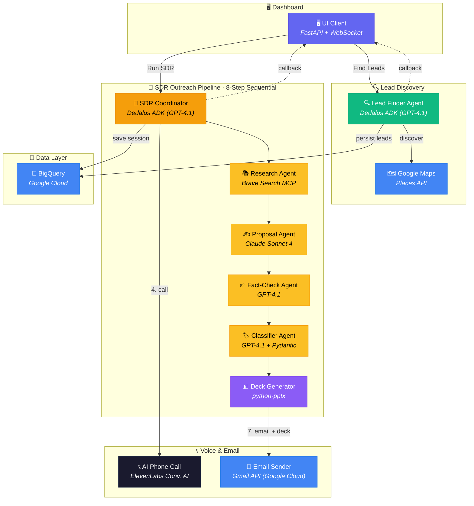
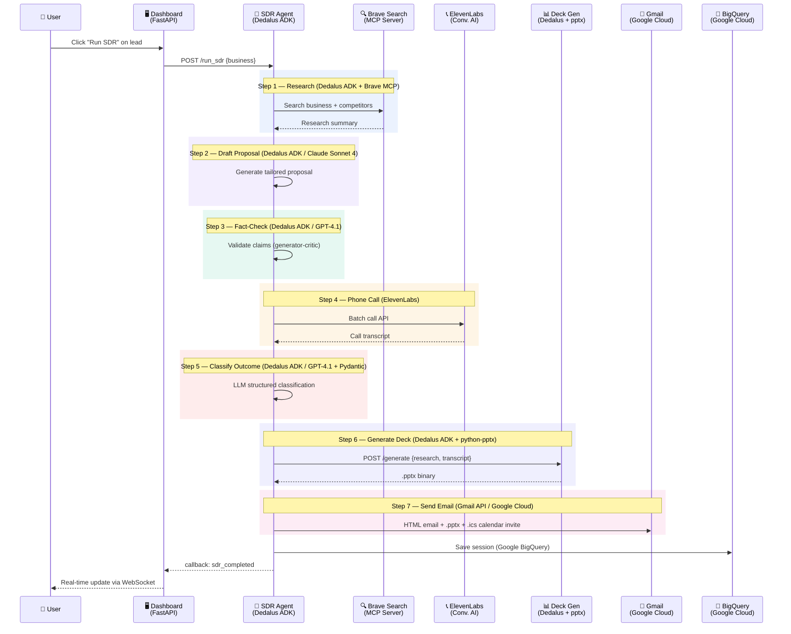
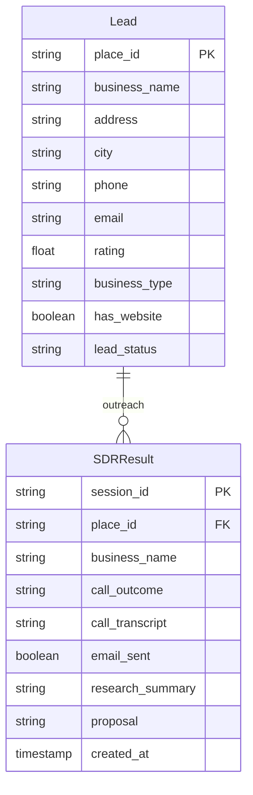

# ⚡ RapidReach — AI-Powered SDR Agent System

<p align="center">
  &nbsp;&nbsp;&nbsp;
  &nbsp;&nbsp;&nbsp;
  &nbsp;&nbsp;&nbsp;
  &nbsp;&nbsp;&nbsp;
  &nbsp;&nbsp;&nbsp;
  &nbsp;&nbsp;&nbsp;
  &nbsp;&nbsp;&nbsp;
  &nbsp;&nbsp;&nbsp;
  &nbsp;&nbsp;&nbsp;
  
</p>

<p align="center">
  <b>Dedalus ADK · Google Cloud · ElevenLabs · Brave Search MCP · FastAPI</b>
</p>

<p align="center">
  <strong>🤖 14 Specialized AI Agents &nbsp;·&nbsp; 🛠️ 12+ Integrated Tools &nbsp;·&nbsp; 🏗️ 5 Microservices &nbsp;·&nbsp; 🎨 8 Agentic Design Patterns</strong>
</p>

> **Find. Research. Call. Close.** — A comprehensive multi-agent system of **14 specialized AI agents** working in concert to automate the **entire sales development lifecycle**, from geographic lead discovery to AI-powered phone calls and branded email outreach.

Built with [Dedalus ADK](https://docs.dedaluslabs.ai) at **Columbia ADI DevFest 2026**.

---

## 📋 Table of Contents

- [What It Does](#-what-it-does)
- [Architecture & Scale](#-architecture--scale)
- [System Architecture](#-system-architecture)
- [Agent Workflow](#-agent-workflow)
- [Key Features](#-key-features)
- [Tech Stack](#-tech-stack)
- [How We Built It](#-how-we-built-it)
- [Challenges We Ran Into](#-challenges-we-ran-into)
- [Accomplishments We're Proud Of](#-accomplishments-were-proud-of)
- [What We Learned](#-what-we-learned)
- [Project Structure](#-project-structure)
- [Quick Start](#-quick-start)
- [Environment Configuration](#-environment-configuration)
- [API Reference](#-api-reference)
- [How the AI Works](#-how-the-ai-works)
- [Design Patterns](#-design-patterns)
- [What's Next](#-whats-next)
- [License](#-license)

---

## 🎯 What It Does

RapidReach is not just a single application — it's a **comprehensive system of 14 specialized AI agents** working in concert across 5 microservices. It replaces the **entire manual SDR workflow** — prospecting, research, cold-calling, proposal writing, and email outreach — with an intelligent multi-agent pipeline that runs autonomously end-to-end:

```
  🔍 DISCOVER          🧠 RESEARCH          📞 CALL             📧 EMAIL
  ┌─────────┐         ┌─────────┐         ┌─────────┐         ┌─────────┐
  │  Google  │────────▶│  Brave  │────────▶│Eleven   │────────▶│ Gmail   │
  │  Maps    │         │  Search │         │  Labs   │         │  API    │
  │  Places  │         │  + LLM  │         │  Voice  │         │ + Deck  │
  │  API     │         │(Dedalus)│         │   AI    │         │(Dedalus)│
  └─────────┘         └─────────┘         └─────────┘         └─────────┘
  Google Maps API      Brave Search MCP    ElevenLabs           Gmail API +
  → find businesses    + Dedalus ADK       Conversational AI    python-pptx
  without websites     (GPT-4.1/Claude)    phone calls          via Dedalus ADK
```

| Step | Agent | Tool / API | What Happens |
|:----:|-------|:----------:|-------------|
| **1** | Lead Finder | **Google Maps Places API** + **Dedalus ADK** | Searches for local businesses **without websites** in a target city |
| **2** | SDR → Research | **Brave Search MCP** via **Dedalus ADK** | Deep-researches each business — reviews, competitors, pain points |
| **3** | SDR → Proposal | **Dedalus ADK** (Claude Sonnet 4) | Generates a tailored website proposal (generator-critic pattern) |
| **4** | SDR → Call | **ElevenLabs** Conversational AI | Places an **AI phone call** and retrieves transcript |
| **5** | SDR → Classify | **Dedalus ADK** (GPT-4.1 + Pydantic) | LLM classifies call outcome: `interested` / `agreed_to_email` / `not_interested` |
| **6** | SDR → Deck | **Dedalus ADK** (GPT-4.1) + `python-pptx` | Generates a professional PowerPoint business solution deck |
| **7** | SDR → Email | **Gmail API** via Google Cloud | Sends branded HTML email with `.pptx` deck + `.ics` calendar invite |

---

## 🏗️ Architecture & Scale

RapidReach is built as a production-grade multi-agent system with impressive scale for a hackathon project:

### 🤖 14 Specialized AI Agents

| # | Agent | Type | Model / Runtime |
|:-:|:------|:-----|:----------------|
| 1 | **Lead Finder Coordinator** | LLM Orchestrator | Dedalus → GPT-4.1 |
| 2 | **SDR Pipeline Coordinator** | Sequential Orchestrator | Direct Python (8-step pipeline) |
| 3 | **Research Agent** | LLM + MCP Tool | Dedalus → GPT-4.1 + Brave Search MCP |
| 4 | **Proposal Draft Agent** | LLM (Creative) | Dedalus → Claude Sonnet 4 |
| 5 | **Fact-Check Agent** | LLM (Analytical) | Dedalus → GPT-4.1 |
| 6 | **Phone Call Agent** | External API | ElevenLabs Conversational AI |
| 7 | **Conversation Classifier** | LLM + Pydantic | Dedalus → GPT-4.1 + Structured Outputs |
| 8 | **Deck Generator Agent** | LLM + Code Gen | Dedalus → GPT-4.1 + python-pptx |
| 9 | **Email Outreach Agent** | API + Template | Gmail API + HTML renderer |
| 10 | **Lead Manager Orchestrator** | Sequential Orchestrator | Python + Dedalus LLM |
| 11 | **Email Checker Sub-Agent** | API Reader | Gmail API (fetch + filter) |
| 12 | **Email Analyzer Sub-Agent** | LLM Classifier | Dedalus → GPT-4.1 (intent + confidence) |
| 13 | **Calendar Organizer Sub-Agent** | API Writer | Google Calendar API + Meet |
| 14 | **Post-Action Sub-Agent** | Data Pipeline | BigQuery + Gmail (mark read) |

### 🛠️ 12+ Integrated Tools

| Tool | API / Library | Purpose |
|:-----|:-------------|:--------|
| Google Maps Search | Places API (New) | Discover businesses without websites |
| Brave Search MCP | MCP Server | Deep web research on prospects |
| Google Search MCP | MCP Server | Fallback research when Brave unavailable |
| ElevenLabs Phone | Conversational AI API | AI-powered cold calls with transcripts |
| Gmail Send | Gmail API (OAuth2) | Branded HTML email with attachments |
| Gmail Read | Gmail API (OAuth2) | Fetch & filter inbound emails |
| Calendar Create | Google Calendar API | Schedule meetings with Meet links |
| BigQuery CRUD | BigQuery API (×3 tables) | Persist leads, sessions, meetings |
| Deck Generator | python-pptx + LLM | Professional PowerPoint decks |
| ICS Generator | Custom Python | Calendar invite attachments |
| Email Extractor | Regex + NLP | Parse dictated emails from transcripts |
| Meeting Time Parser | Regex + NLP | Extract scheduling from spoken text |
| UI Callback | HTTP POST + WebSocket | Real-time dashboard event streaming |

### 🏗️ 5 Microservices

```
┌──────────────────────────────────────────────────────────────────────────┐
│                        MICROSERVICE TOPOLOGY                            │
│                                                                         │
│   ┌─────────────┐   ┌─────────────┐   ┌─────────────┐                  │
│   │  UI Client   │   │ Lead Finder  │   │  SDR Agent   │                │
│   │   :8000      │◄─►│   :8081      │   │   :8084      │                │
│   │  (FastAPI +  │   │ (Dedalus +   │   │ (8-step      │                │
│   │  WebSocket)  │   │  Maps API)   │   │  pipeline)   │                │
│   └──────────────┘   └──────────────┘   └──────┬───────┘                │
│          ▲                                      │                       │
│          │           ┌─────────────┐   ┌────────▼──────┐                │
│          └───────────│Lead Manager │   │Deck Generator │                │
│    callbacks         │   :8082     │   │   :8086       │                │
│                      │(Gmail+Cal+  │   │(Dedalus +     │                │
│                      │ BigQuery)   │   │ python-pptx)  │                │
│                      └─────────────┘   └───────────────┘                │
│                                                                         │
│   Communication: HTTP REST + WebSocket callbacks + Dedalus ADK          │
└──────────────────────────────────────────────────────────────────────────┘
```

### 🎨 8 Agentic Design Patterns

1. **Agent-as-Tool** — Specialist agents invoked as tool functions by coordinators
2. **Coordinator + Specialists** — Cheap model routes, strong models execute
3. **Generator-Critic** — Draft Agent writes → Fact-Check Agent validates → refined output
4. **Structured Outputs** — Pydantic `response_format` for guaranteed JSON schemas
5. **Callback Broadcasting** — All services POST to `/agent_callback` → WebSocket fan-out
6. **Multi-Tier Fallback** — Brave MCP → Google MCP → LLM knowledge → template
7. **Merge-not-Replace** — New data merges with existing by ID (preserves state across restarts)
8. **Shared Domain Models** — Pydantic models as single source of truth across all services

---

## 🏗️ System Architecture

### High-Level Service Map



### Service Overview

| Service | Port | Powered By | Role |
|:--------|:----:|:----------:|------|
| **UI Client** | `8000` | FastAPI + Jinja2 | Dashboard — WebSocket real-time updates, workflow trigger proxy |
| **Lead Finder** | `8081` | Dedalus ADK + Google Maps | Google Maps search → dedup → BigQuery storage (up to 60 results/type) |
| **SDR Agent** | `8084` | Dedalus ADK + ElevenLabs + Gmail | Full pipeline: research → proposal → call → classify → deck → email |
| **Deck Generator** | `8086` | Dedalus ADK + python-pptx | AI-powered PowerPoint business solution deck generation |

### Data Flow

```
┌─────────────────────────────────────────────────────────────────────────────────────┐
│                              DATA FLOW                                              │
├─────────────────────────────────────────────────────────────────────────────────────┤
│                                                                                     │
│  User clicks "Find Leads"                                                           │
│       │                                                                             │
│       ▼                                                                             │
│  ┌──────────┐  Google Maps   ┌──────────┐  BigQuery    ┌──────────┐                 │
│  │ UI Client│──────────────▶│Lead Finder│─────────────▶│ BigQuery │                 │
│  │  :8000   │◀──callback────│  :8081    │  (Dedalus    │ (Google  │                 │
│  │ (FastAPI)│  (WebSocket)  │ (Dedalus) │   ADK)       │  Cloud)  │                 │
│  └──────────┘               └──────────┘              └──────────┘                 │
│       │                                                     ▲                       │
│       │ User clicks "Run SDR"                               │                       │
│       ▼                                                     │                       │
│  ┌──────────┐  Brave MCP    ┌──────────┐  Save session      │                       │
│  │SDR Agent │──────────────▶│ Research  │───────────────────┘                       │
│  │  :8084   │  (Dedalus)    │(Dedalus) │                                            │
│  │(Dedalus) │               ├──────────┤                                            │
│  │          │  Dedalus ADK  │ Proposal  │                                           │
│  │          │──────────────▶│(Claude S4)│                                           │
│  │          │               ├──────────┤                                            │
│  │          │  ElevenLabs   │ AI Call   │                                           │
│  │          │──────────────▶│          │                                            │
│  │          │               ├──────────┤                                            │
│  │          │  Dedalus ADK  │ Classify  │                                           │
│  │          │──────────────▶│(GPT-4.1) │                                           │
│  │          │               ├──────────┤                                            │
│  │          │  python-pptx  │ Deck Gen  │──▶ .pptx                                  │
│  │          │──────────────▶│(Dedalus) │                                            │
│  │          │               ├──────────┤                                            │
│  │          │  Gmail API    │  Email    │──▶ HTML + .pptx + .ics                    │
│  └──────────┘  (Google)     └──────────┘                                           │
│                                                                                     │
└─────────────────────────────────────────────────────────────────────────────────────┘
```

---

## 🤖 Agent Workflow

### SDR Pipeline (per lead)



---

## ✨ Key Features

### 🔍 Lead Discovery (Google Maps + Dedalus ADK)
- **Geographic targeting** — search any city via **Google Maps Places API**
- **Smart filtering** — auto-excludes chains (Starbucks, McDonald's, etc.) via **Dedalus ADK** orchestration
- **No-website filter** — only finds businesses without web presence (highest-value prospects)
- **Pagination** — follows `next_page_token` for up to 60 results per business type
- **Data persistence** — leads stored in **Google BigQuery** with dedup by `place_id`
- **Mock fallback** — works in local dev without API key (generates mock data)

### 🧠 AI Research & Proposals (Dedalus ADK + Brave MCP)
- **Deep web research** via **Brave Search MCP** through **Dedalus ADK** — reviews, competitors, market position
- **Generator-critic pattern** — **Dedalus ADK** (Claude Sonnet 4) drafts → **Dedalus ADK** (GPT-4.1) fact-checks → refined output
- **Model specialization** — GPT-4.1 for research/coordination, Claude Sonnet 4 for creative drafting — both routed via **Dedalus ADK**

### 📞 AI Voice Calls (ElevenLabs + Dedalus ADK)
- **Natural conversations** via **ElevenLabs** Conversational AI
- **Batch calling API** with transcript polling (**ElevenLabs**)
- **Structured classification** — **Dedalus ADK** (GPT-4.1 + Pydantic) parses transcript into `interested` / `agreed_to_email` / `not_interested`
- **Email extraction** — sophisticated parser handles dictated addresses ("a-r-n-a-v at gmail dot com")

### 📧 Professional Email Outreach (Gmail API + Dedalus ADK)
- **Branded HTML emails** — gradient header, CTA button, professional footer sent via **Gmail API** (Google Cloud)
- **PowerPoint attachment** — AI-generated deck via **Dedalus ADK** + `python-pptx`
- **Calendar invite** — .ics file with proposed meeting time
- **Fallback email** — uses configured fallback when no business email found

### 📊 Deck Generation
- **AI-powered content** — executive summary, situation analysis, proposed solutions, ROI, timeline (via **Dedalus ADK**)
- **Professional slides** — built with `python-pptx`, styled for business presentations
- **Template system** — professional, creative, and tech color schemes

### 🖥️ Real-Time Dashboard
- **WebSocket updates** — live event streaming from all agents
- **Lead table** — discovered businesses with status badges
- **SDR Outreach tab** — session cards with call outcomes and email status
- **Stats bar** — leads found, contacted, emails sent

---

## 🛠️ Tech Stack

```
┌─────────────────────────────────────────────────────────┐
│                    TECH STACK                            │
├─────────────────────────────────────────────────────────┤
│                                                         │
│  🤖 AI & Orchestration (Dedalus ADK)                    │
│  ├── Dedalus ADK — agent-as-tool orchestration (core)   │
│  ├── Dedalus ADK → OpenAI GPT-4.1 — research, classify │
│  ├── Dedalus ADK → Claude Sonnet 4 — proposal drafting  │
│  ├── Dedalus ADK → Brave Search MCP — web research      │
│  └── ElevenLabs — conversational AI phone calls         │
│                                                         │
│  🔧 Backend                                             │
│  ├── Python 3.12 / FastAPI                              │
│  ├── WebSockets — real-time dashboard updates           │
│  ├── httpx — async HTTP client                          │
│  ├── Pydantic v2 — data validation & structured output  │
│  └── python-pptx — PowerPoint deck generation           │
│                                                         │
│  ☁️ Google Cloud                                         │
│  ├── Google BigQuery — leads + sessions storage         │
│  ├── Gmail API — send outreach emails                   │
│  ├── Google Maps Places API — business discovery        │
│  └── Google OAuth2 — authentication                     │
│                                                         │
│  🖥️ Frontend                                            │
│  ├── Vanilla HTML/CSS/JS — no framework overhead        │
│  ├── Jinja2 templates — server-side rendering           │
│  └── Dark theme dashboard — real-time WebSocket UI      │
│                                                         │
└─────────────────────────────────────────────────────────┘
```

---

## 📁 Project Structure

```
rapidreach/
├── .env                            # API keys & configuration
├── pyproject.toml                  # Python packaging & dependencies
├── requirements.txt                # pip install dependencies
│
├── common/                         # ── Shared across all services ──
│   ├── config.py                   #    Ports, URLs, BigQuery config, model names
│   └── models.py                   #    Pydantic: Lead, Meeting, SDRResult, AgentCallback, etc.
│
├── lead_finder/                    # ── Service 1: Discover Leads ──
│   ├── __main__.py                 #    Entrypoint (port 8081)
│   ├── agent.py                    #    FastAPI + Dedalus ADK orchestration
│   ├── prompts.py                  #    LEAD_FINDER_PROMPT, MERGER_PROMPT templates
│   └── tools/
│       ├── maps_search.py          #    Google Maps Places API (pagination + mock fallback)
│       └── bigquery_utils.py       #    Google BigQuery: lead persistence + dedup
│
├── sdr/                            # ── Service 2: SDR Outreach Pipeline ──
│   ├── __main__.py                 #    Entrypoint (port 8084)
│   ├── agent.py                    #    Dedalus ADK pipeline: research → call → email → deck
│   └── tools/
│       ├── phone_call.py           #    ElevenLabs batch calls + transcript polling
│       ├── email_tool.py           #    Gmail API: MIME email with .pptx + .ics attachments
│       └── bigquery_utils.py       #    Google BigQuery: SDR session persistence
│
├── deck_generator/                 # ── Service 3: PowerPoint Generation ──
│   ├── __main__.py                 #    Entrypoint (port 8086)
│   └── agent.py                    #    Dedalus ADK content gen + python-pptx rendering
│
└── ui_client/                      # ── Service 4: Dashboard ──
    ├── __main__.py                 #    Entrypoint (port 8000)
    ├── main.py                     #    FastAPI: WebSocket, callbacks, workflow proxies
    ├── templates/
    │   └── dashboard.html          #    Interactive dark-theme dashboard
    └── static/
        ├── css/style.css           #    Dark theme styles
        └── js/app.js               #    WebSocket client + UI state management
```

---

## 🚀 Quick Start

### 1. Clone & Install

```bash
git clone <repo-url>
cd adi-devfest-hackathon
python3 -m venv .venv
source .venv/bin/activate
pip install -r requirements.txt
```

### 2. Configure Environment

Copy and fill in your API keys in `.env`:

```env
# ── Required: AI Orchestration ──
DEDALUS_API_KEY=your-dedalus-key               # https://dedaluslabs.ai/dashboard/api-keys

# ── Required: Lead Discovery ──
GOOGLE_MAPS_API_KEY=your-maps-key              # GCP Console → APIs → Places API

# ── Required: Data Persistence ──
GOOGLE_CLOUD_PROJECT=your-gcp-project          # GCP Console → Project ID

# ── Required: Phone Calls ──
ELEVENLABS_API_KEY=your-elevenlabs-key         # https://elevenlabs.io
ELEVENLABS_AGENT_ID=your-agent-id              # ElevenLabs → Conversational AI → Agents
ELEVENLABS_PHONE_NUMBER_ID=your-phone-id       # ElevenLabs → Phone Numbers

# ── Required: Email ──
SALES_EMAIL=sales@yourdomain.com

# ── Optional: LLM Models ──
DEFAULT_MODEL=openai/gpt-4.1                   # Coordinator + research
DRAFT_MODEL=anthropic/claude-sonnet-4-20250514  # Proposal writing

# ── Optional: Fallback ──
FALLBACK_EMAIL=your-fallback@gmail.com         # Used when no business email found
```

### 3. Run All Services

Open **4 terminal tabs** and start each service:

```bash
# Terminal 1 — 🖥️ Dashboard (start first)
PYTHONPATH=. python -m ui_client

# Terminal 2 — 🔍 Lead Finder
PYTHONPATH=. python -m lead_finder

# Terminal 3 — 🧠 SDR Agent
PYTHONPATH=. python -m sdr

# Terminal 4 — 📊 Deck Generator
PYTHONPATH=. python -m deck_generator
```

### 4. Use It

```
┌──────────────────────────────────────────────────────────────┐
│                     🚀 GETTING STARTED                       │
├──────────────────────────────────────────────────────────────┤
│                                                              │
│  1. Open  http://localhost:8000  in your browser             │
│                                                              │
│  2. Enter a city (e.g. "San Francisco, CA")                  │
│     → Click "Find Leads"                                     │
│     → Watch leads populate in real-time                      │
│                                                              │
│  3. Click "Run SDR" on any lead                              │
│     → Agent researches, calls, emails automatically          │
│     → Track progress in the activity log                     │
│                                                              │
└──────────────────────────────────────────────────────────────┘
```

---

## 🔑 Environment Configuration

### API Keys Guide

| Key | Where to Get It | What It Enables |
|:----|:----------------|:----------------|
| `DEDALUS_API_KEY` | [Dedalus Dashboard](https://dedaluslabs.ai/dashboard/api-keys) | All LLM calls (OpenAI, Anthropic) via unified API |
| `GOOGLE_MAPS_API_KEY` | [GCP Console](https://console.cloud.google.com/apis/credentials) → Enable Places API | Lead discovery via Maps |
| `GOOGLE_CLOUD_PROJECT` | GCP Console → Project ID | BigQuery data storage |
| `SALES_EMAIL` | Your Gmail/Workspace email | Sending outreach emails |
| `ELEVENLABS_API_KEY` | [ElevenLabs](https://elevenlabs.io) | AI phone calls |
| `ELEVENLABS_AGENT_ID` | ElevenLabs → Conversational AI → Create Agent | Phone call agent persona |
| `ELEVENLABS_PHONE_NUMBER_ID` | ElevenLabs → Phone Numbers | Outbound caller ID |

### GCP Service Account Permissions

```
Required IAM Roles / OAuth Scopes:
├── Gmail API   → gmail.send (send outreach emails)
├── BigQuery    → bigquery.dataEditor, bigquery.user
└── Maps API    → Places API enabled
```

---

## 📡 API Reference

### UI Client — `:8000`

| Method | Endpoint | Description |
|:------:|----------|-------------|
| `GET` | `/` | Dashboard HTML |
| `WS` | `/ws` | WebSocket — real-time event stream |
| `POST` | `/agent_callback` | Receive agent status callbacks |
| `POST` | `/start_lead_finding` | Trigger lead discovery for a city |
| `POST` | `/start_sdr` | Trigger SDR pipeline for a lead |
| `GET` | `/api/businesses` | Get all discovered leads |
| `GET` | `/api/sdr_sessions` | Get SDR session history |
| `GET` | `/api/events` | Get activity event log |
| `POST` | `/api/human-input/request` | Agent requests human feedback |
| `POST` | `/api/human-input/respond` | Human provides feedback |

### Lead Finder — `:8081`

| Method | Endpoint | Description |
|:------:|----------|-------------|
| `GET` | `/health` | Health check |
| `POST` | `/find_leads` | Start lead discovery `{city, business_types, radius_km, max_results}` |
| `GET` | `/api/leads?city=` | Get discovered leads (BigQuery + in-memory) |

### SDR Agent — `:8084`

| Method | Endpoint | Description |
|:------:|----------|-------------|
| `GET` | `/health` | Health check |
| `POST` | `/run_sdr` | Execute full SDR pipeline for a lead |
| `GET` | `/api/sessions` | Get all SDR sessions (BigQuery + in-memory merged) |

### Deck Generator — `:8086`

| Method | Endpoint | Description |
|:------:|----------|-------------|
| `GET` | `/health` | Health check |
| `POST` | `/generate` | Generate PowerPoint deck from SDR session data |

---

## 🧠 How the AI Works

### Agent-as-Tool Pattern

RapidReach uses the **Dedalus ADK** with a coordinator → specialist architecture:

```
┌──────────────────────────────────────────────────────────┐
│              COORDINATOR AGENT (Dedalus ADK)              │
│                  (GPT-4.1 via Dedalus)                   │
│                                                          │
│   "Research this business, draft a proposal,             │
│    call them, then send an email"                        │
│                                                          │
│   ┌─────────┐  ┌─────────┐  ┌─────────┐  ┌─────────┐   │
│   │Research │  │ Draft   │  │  Call   │  │ Email   │   │
│   │  Tool   │  │  Tool   │  │  Tool   │  │  Tool   │   │
│   └────┬────┘  └────┬────┘  └────┬────┘  └────┬────┘   │
│        │            │            │            │         │
│        ▼            ▼            ▼            ▼         │
│   Dedalus ADK   Dedalus ADK  ElevenLabs  Gmail API     │
│   + Brave MCP   + Claude S4   Batch API  (Google)      │
│                                                          │
└──────────────────────────────────────────────────────────┘
```

### Model Specialization

```
┌────────────────────┬────────────────────────────┬─────────────────────┐
│      Task          │       Model (via Dedalus)  │       Why           │
├────────────────────┼────────────────────────────┼─────────────────────┤
│ Coordination       │ Dedalus → GPT-4.1          │ Fast, cheap routing │
│ Web Research       │ Dedalus → GPT-4.1 + Brave  │ Grounded in search  │
│ Proposal Drafting  │ Dedalus → Claude Sonnet 4   │ Creative writing    │
│ Fact-Checking      │ Dedalus → GPT-4.1          │ Analytical          │
│ Classification     │ Dedalus → GPT-4.1 + Pydantic│ Structured output  │
│ Deck Content       │ Dedalus → GPT-4.1          │ Structured JSON     │
└────────────────────┴────────────────────────────┴─────────────────────┘
```

### Structured Outputs

Classification and analysis use **Pydantic `response_format`** for reliable parsing:

```python
# Classify call outcome with guaranteed schema (via Dedalus ADK)
result = await runner.run(
    input="Classify this call transcript...",
    model="openai/gpt-4.1",  # Routed through Dedalus ADK
    response_format=ConversationClassification,  # Pydantic model
)
# Result is always: {outcome: "interested"|"agreed_to_email"|"not_interested", ...}
```

---

## 🎨 Design Patterns

| Pattern | Where | How |
|:--------|:------|:----|
| **Agent-as-Tool** | SDR (Dedalus ADK) | Each specialist is a nested `runner.run()` call wrapped as a tool function — the coordinator invokes research, drafting, classification as callable tools |
| **Coordinator + Specialists** | All agents (Dedalus ADK) | Cheap model (GPT-4.1) coordinates routing; Claude Sonnet 4 handles creative drafting; GPT-4.1 + Pydantic handles classification |
| **Generator-Critic** | Proposal pipeline (Dedalus ADK) | Draft agent (Claude) writes → Fact-check agent (GPT-4.1) validates → refined output; ensures accuracy before reaching prospects |
| **Structured Outputs** | Classification (Dedalus ADK) | Pydantic `response_format` ensures LLM returns valid JSON matching `ConversationClassification` schema every time |
| **Callback Broadcasting** | All services → UI (FastAPI) | Services POST to `/agent_callback` → WebSocket broadcast to all connected dashboard clients |
| **Multi-Tier Fallback** | Research + Maps | Brave MCP → Google Search MCP → LLM knowledge → static template; Maps API → mock data; ensures the pipeline never fully fails |
| **Shared Domain Models** | `common/models.py` (Pydantic) | `Lead`, `SDRResult`, `Meeting`, `AgentCallback`, `EmailAnalysis` — single source of truth across all 5 services |
| **Merge-not-Replace** | SDR sessions, Leads (BigQuery) | New data merges with existing by ID (never overwrites accumulated state); in-memory overlays BigQuery history |

---

## 🔨 How We Built It

RapidReach is not just a single script — it's a **comprehensive system of 14 specialized AI agents** working in concert across **5 microservices**, communicating via HTTP callbacks and WebSocket real-time updates. We built the entire system from scratch in a single hackathon sprint.

### 🏗️ Architecture Decisions

- **Dedalus ADK as the AI backbone** — Every LLM interaction flows through Dedalus's unified API, letting us route between OpenAI GPT-4.1 and Anthropic Claude Sonnet 4 with a single `model=` parameter change. No vendor lock-in, no separate SDK integrations.
- **Agent-as-Tool pattern** — Instead of one monolithic prompt, we decomposed the SDR workflow into 8 discrete specialist agents, each invoked as a tool function by a lightweight coordinator. This gave us modularity, debuggability, and the ability to swap models per task.
- **Direct sequential execution** — After experimenting with LLM-driven orchestration (where the coordinator decides step order), we switched to deterministic Python-driven sequencing for the SDR pipeline. This guarantees every step executes in order — research → proposal → fact-check → call → classify → deck → email → save — with no steps skipped by a hallucinating orchestrator.
- **Real-time dashboard** — WebSocket-powered event streaming means the user sees every agent step as it happens — "Researching...", "Calling...", "Email sent!" — creating an engaging, transparent experience.

### 🛠️ Technology Choices

- **Dedalus ADK** — Unified LLM gateway with MCP server support, structured outputs, and multi-model routing
- **Google Maps Places API (New)** — Pagination with `next_page_token` for up to 60 results per business type; smart chain exclusion
- **ElevenLabs Conversational AI** — Batch calling API with async transcript polling; natural voice that prospects actually engage with
- **Gmail API (OAuth2)** — MIME multipart emails with HTML body + `.pptx` attachment + `.ics` calendar invite in a single message
- **python-pptx** — AI-generated slide content rendered into professional PowerPoint decks with branded color schemes
- **Google BigQuery** — Three tables (`leads`, `sdr_sessions`, `meetings`) with automatic schema creation and merge-on-fetch recovery

---

## 🧗 Challenges We Ran Into

Building a system this complex in a hackathon presented significant challenges:

### 🎯 Orchestrating 14 Agents Across 5 Services
Managing the state and communication flow between fourteen agents spread across five microservices was our biggest challenge. Each agent produces output that the next agent depends on — research feeds proposals, call transcripts feed classification, classification determines email content. Ensuring proper coordination and maintaining data consistency required careful state management and robust error handling at every step.

### 📞 Spoken Email Extraction from Phone Transcripts
When ElevenLabs captures a phone call transcript, business owners dictate their email addresses in unpredictable ways — *"T M zero seven M A R C H at gmail dot com"* or *"it's my email tm07march at gmail.com"*. We built a sophisticated 5-tier regex parser with number word mapping, leading word stripping, and priority-ranked deduplication to reliably extract emails from messy spoken text. This single function is 80+ lines of carefully tuned regex logic.

### 🔗 MCP Server Reliability & Fallback Chains
Brave Search MCP and Google Search MCP servers don't always respond reliably during high-traffic hackathon conditions. We implemented a three-tier fallback chain — Brave MCP → Google Search MCP → LLM knowledge-based research → static template — so the pipeline **never fully fails**, even if every external search API is down. Getting the cascading exception handling right without losing context between tiers was tricky.

### 🤖 LLM Orchestration vs. Deterministic Control
We initially used the Dedalus ADK's `DedalusRunner` to let the LLM orchestrator decide which tools to call and in what order. This worked well for the Lead Finder (where the LLM coordinates Maps search + BigQuery storage). But for the 8-step SDR pipeline, we found the LLM would sometimes skip steps, reorder them, or hallucinate tool calls. We pivoted to direct Python sequential execution for the SDR — the coordinator calls each specialist function directly, guaranteeing the full pipeline executes every time.

### 🎨 Building Professional Email + Deck Output
Creating output that looks genuinely professional — not "AI-generated" — required significant iteration. The HTML email uses gradient headers, styled CTAs, and semantic bullet points. The PowerPoint deck uses professional color schemes with proper slide layouts. Getting the MIME encoding right for a single email containing HTML body + base64-encoded `.pptx` + `.ics` calendar invite took substantial debugging.

---

## 🏆 Accomplishments We're Proud Of

### 💡 Technical Achievements
- **Successfully orchestrated 14 AI agents** in a cohesive, working system — each agent has a clear responsibility and produces outputs consumed by downstream agents
- **Implemented 8 distinct agentic design patterns** — Agent-as-Tool, Generator-Critic, Structured Outputs, Multi-Tier Fallback, Callback Broadcasting, Coordinator+Specialists, Merge-not-Replace, Shared Domain Models
- **Built a complete end-to-end pipeline** — from typing a city name to a business receiving a personalized phone call, branded email with PowerPoint deck, and calendar invite — fully autonomous
- **3-tier research fallback** that ensures the pipeline never fails — Brave MCP → Google Search MCP → LLM knowledge → static template
- **Sophisticated NLP parsing** — 80+ lines of regex logic to extract emails from spoken transcripts ("T M zero seven march at gmail dot com" → `tm07march@gmail.com`)

### 💼 Business Impact
- **Replaces an entire human SDR workflow** — lead discovery, research, cold-calling, proposal writing, email outreach — tasks that take a human sales rep hours per lead
- **Actually calls real phone numbers** via ElevenLabs — not a mock or simulation, but production-grade conversational AI phone calls
- **Sends real emails** with professional HTML formatting, PowerPoint attachments, and iCalendar invites — indistinguishable from a human sales team
- **Scales from one city to any city** — type "San Francisco" or "Mumbai" and the system finds, researches, and reaches out to local businesses

### 🎨 User Experience
- **Real-time WebSocket dashboard** — watch every agent step as it happens: "Researching...", "Calling...", "Classifying...", "Email sent!"
- **Professional output quality** — gradient-styled HTML emails, branded PowerPoint decks, `.ics` calendar invites
- **One-click operation** — click "Find Leads" then "Run SDR" and the entire 8-step pipeline executes autonomously

---

## 📚 What We Learned

Starting this project was an ambitious leap for us. We built the entire system from scratch in a single hackathon sprint, which meant a steep but incredibly rewarding learning curve.

### 🤖 Dedalus ADK & Multi-Model Orchestration
We were new to Dedalus ADK, but we were immediately impressed by its unified approach to multi-model AI orchestration. We learned how to route between **GPT-4.1** (fast, analytical) and **Claude Sonnet 4** (creative, nuanced) within the same pipeline — using the cheap model for coordination and research, and the strong model for proposal writing. The **MCP server integration** (Brave Search, Google Search) gave us grounded web research without building custom scrapers. The `DedalusRunner` abstraction let us focus on agent logic rather than API plumbing.

### 📞 ElevenLabs Conversational AI
Integrating real phone calls into an automated pipeline was one of our most exciting challenges. We learned how ElevenLabs' **batch calling API** works — you initiate a call, then poll for the transcript asynchronously. The conversational AI agent needs careful prompt engineering to sound natural, ask the right questions, and gracefully handle rejection. We also learned that parsing spoken email addresses from transcripts is a problem nobody has cleanly solved — so we built our own 5-tier regex parser.

### ☁️ Google Cloud APIs in Concert
We learned how to use **Google Maps Places API (New)** with pagination tokens for deep business discovery, **Gmail API** with OAuth2 for sending MIME multipart emails with attachments, **Google Calendar API** for programmatic meeting creation with Google Meet links, and **BigQuery** for structured data persistence with automatic schema management. Getting all four Google APIs working together with proper OAuth2 scoping was a valuable lesson in cloud-native development.

### 🏗️ Agentic Architecture Patterns
Perhaps our biggest takeaway was learning when to let the LLM orchestrate vs. when to use deterministic control. The Lead Finder works beautifully with LLM-driven tool calling (the agent decides how to search and store). But the SDR pipeline needed deterministic Python sequencing to guarantee all 8 steps execute. We also learned the power of the **Generator-Critic pattern** — having one model draft and another model critique produces dramatically better output than a single model alone.

We came away from this hackathon with a profound appreciation for how powerful modern AI tooling has become. Dedalus ADK, Google Cloud, and ElevenLabs gave us building blocks that let a small team build something that would have taken an enterprise sales team months to replicate manually.

---

## 🔮 What's Next

### 🚀 Immediate Enhancements
- **Industry Specialization** — Expand beyond website development to target other service industries (legal, healthcare, consulting)
- **Advanced Analytics Dashboard** — ML-powered conversion prediction and A/B testing on proposal styles
- **Multi-Language Support** — Localized phone calls and emails for international markets
- **CRM Integration** — Connect with Salesforce, HubSpot, and Pipedrive for enterprise workflows

### 🌟 Long-term Vision
- **Parallel Lead Processing** — Fan-out/gather pattern to research and call multiple leads simultaneously
- **AI-Powered Negotiations** — Advanced follow-up agents that handle objections and close deals
- **Predictive Lead Scoring** — Use historical conversion data to prioritize the highest-value prospects
- **Voice Cloning & Personalization** — Custom voice profiles for different industries and markets
- **Human-in-the-Loop Refinement** — Let sales managers review and edit proposals before they're sent

### 🔧 Platform Evolution
- **Agent Marketplace** — Allow users to create and share custom specialist agents
- **No-Code Pipeline Builder** — Drag-and-drop interface to compose custom SDR workflows
- **Webhook Integrations** — Connect with Slack, Teams, and other business tools for notifications

RapidReach represents just the beginning of what's possible when combining Dedalus ADK's multi-model orchestration, Google Cloud's powerful APIs, and ElevenLabs' conversational AI with real-world business needs. We're excited to continue pushing the boundaries of AI-powered sales automation!

---

## 📊 Data Models



---

## 📜 License

Built at **Columbia ADI DevFest Hackathon 2026**.

---

<p align="center">
  <strong>⚡ RapidReach</strong> — 14 AI Agents · 12+ Tools · 5 Microservices · 8 Design Patterns<br/>
  <em>Built with ❤️ for automating the sales development process</em>
</p>
